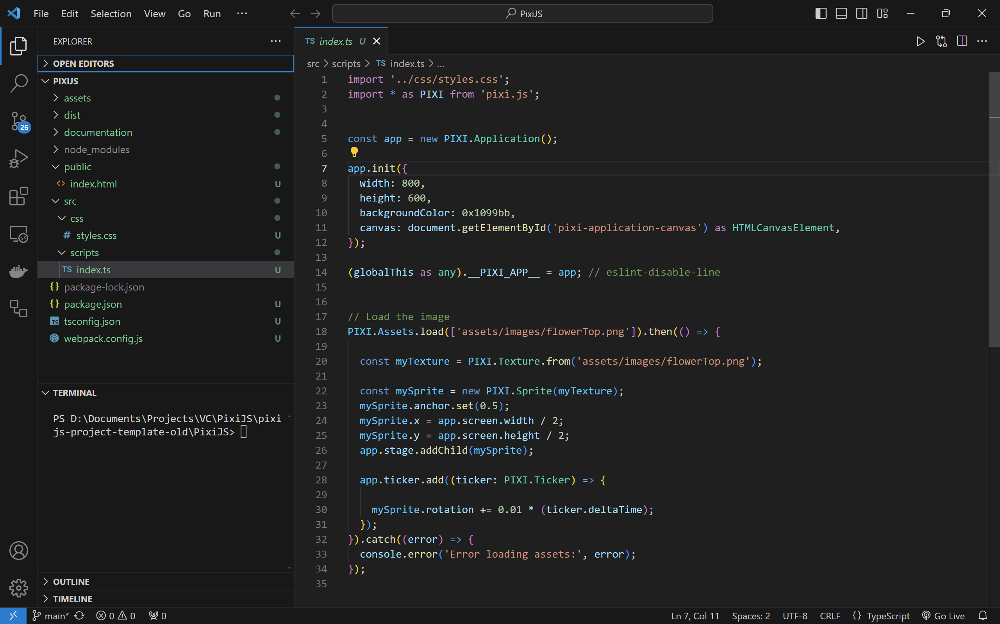

# PixiJS Project Template

This repo includes a great starting point for new [PixiJS](https://pixijs.com/) projects while using [TypeScript](https://www.typescriptlang.org/).

<figure>
    
    <figcaption>Image 1 - PixiJS Game Engine - Html5 + WebGPU</figcaption>
</figure>

### Table of Contents

1. [Getting Started](#getting-started)
1. [Project Overview](#project-overview)
1. [Project Details](#project-details)
1. [Resources](#resources)
1. [Credits](#credits)

 

# Getting Started

### Play Project

1. Browse to [SamuelAsherRivello.github.io/pixi-project-template/dist/index.html](https://samuelasherrivello.github.io/pixi-project-template/dist/index.html)
2. Enjoy!

### Build Project

1. Download this repo (*.zip or *.git)
1. Open the `PixiJS` folder in the command line:
    1. Install dependencies:
        * Run `npm install` to download and install dependencies.
    1. Build the project:
        * Run `npm run client-build` to build the project.
    1. Run the project:
        * Run `npm run client-start-watch` to launch a server to localhost. _This serves the development build and hot-reloads on changes_ within the _**src**_. This is fantastic!
1. Play the game at [localhost:3000](http://localhost:3000)
1. Open the `PixiJS` folder in [Visual Studio Code](https://code.visualstudio.com/) or your favorite editor 
1. Do your game development
1. Optional: When you add/update files within the `PixiJS` you may need to repeat step 2. See [Webpack Beginner's Guide](https://medium.com/javascript-training/beginner-s-guide-to-webpack-b1f1a3638460) for more info
1. Optional: [Host](https://gist.github.com/TylerFisher/6127328) your project online and share the link with friends! 
1. Enjoy !

 

### More Commands

You can run these terminal commands during your workflows.

| Command                      | Description                                    | Builds? | Runs?   | Tests?  | Watches?  |
|------------------------------|------------------------------------------------|---------|--------|--------|----------|
| `npm install`                | Required: Download and install dependencies        | ❌      | ❌     | ❌     | ❌       |
| `npm run client-build`       | Required: Build app                                | ✅      | ❌     | ❌     | ❌       |
| `npm run client-start-watch` | Required: Run app on localhost                     | ❌      | ✅     | ❌     | ✅       |
| `npm run tests-start-watch`  | Optional: Run unit tests                           | ❌      | ❌     | ✅     | ✅       |
 

# Project Overview

This repo has been heavily modified and now demonstrates best practices for combining HTML5 technologies for game development in the browser.

Use cases for this repo include light-weight prototypes, educational projects, and browser-based game development.

 

<figure>
    
    <figcaption>Image 2 - Editor Environment (File Explorer, Terminal, Code Editor)</figcaption>
</figure>

  

<figure>
    
    <figcaption>Image 3 - Runtime Environment (Browser, PixiJS DevTools, Console)</figcaption>
</figure>

  

**Documentation**
* `ReadMe.md` - The primary documentation for this repo
* `PixiJS/documentation/` - More info specific to the project

**Configuration**
* `Game Engine` - [PixiJS](https://www.pixijs.com/) is a flexible and fast 2D rendering library for web-based graphics and games

**Structure**

* `PixiJS` - Main project folder
* `PixiJS/assets/images/` - User-facing image assets
* `PixiJS/public/index.html` - User-facing html page
* `PixiJS/src/css/` - CSS styling
* `PixiJS/src/scripts/` - Additional TS files
* `PixiJS/src/scripts/index.ts` - Main TS file for game logic. Do your work here :)

**Dependencies**
* `./PixiJS/package.json` - Lists project dependencies and scripts. When you run `npm install` it installs whatever is here

 

# Project Details

 

**Editor Tooling**

| Name                                                                                           | Description                                    | Runtime? | Edit Time? |
|------------------------------------------------------------------------------------------------|------------------------------------------------|----------|------------|
| [Visual Studio Code](https://code.visualstudio.com/)                                           | Source code editor                             | ❌       | ✅          |
| [ESLint extension](https://marketplace.visualstudio.com/items?itemName=dbaeumer.vscode-eslint) | VS Code extension for linting JavaScript/TS    | ❌        | ✅          |
| [Error Lens extension](https://marketplace.visualstudio.com/items?itemName=usernamehw.errorlens)| Highlights errors and warnings in VS Code      | ❌        | ✅          |
| [PixiJS DevTools ](https://bit.ly/pixijs-devtools)| Browser Extension with Scene Hierarchy & Sprite Inspector      | ✅        | ❌          |

 

**Code Packages (Partial List)**

| Name                                                              | Description                                         | Runtime? | Edit Time? |
|-------------------------------------------------------------------|-----------------------------------------------------|----------|--------------|
| [pixi.js](https://www.npmjs.com/package/pixi.js)                  | PixiJS: 2D rendering engine                         | ✅       | ❌           |
| [@pixi/ui](https://www.npmjs.com/package/@pixi/ui)                | PixiJS: UI components                               | ✅       | ❌           |
| [pixi-actions](https://www.npmjs.com/package/pixi-actions)        | PixiJS plugin for tweening                          | ✅       | ❌           |
| [pixi-filters](https://www.npmjs.com/package/pixi-filters)        | PixiJS filters                                      | ✅       | ❌           |
| [webpack](https://www.npmjs.com/package/webpack)                  | Bundles JavaScript files                            | ❌       | ✅           |
| [typescript](https://www.npmjs.com/package/typescript)            | TypeScript compiler                                 | ❌       | ✅           |
| [eslint](https://www.npmjs.com/package/eslint)                    | Makes your TypeScript pretty       | ❌       | ✅           |
| [jest](https://www.npmjs.com/package/jest)                        | Unit testing for TypeScript                        | ❌       | ✅           |

 
 

# Resources

  

 
Here are some non-HTML5 resources which may also be helpful with HTML5 game projects.

 

* Samuel Asher Rivello's Video Playlist : <a href="https://www.samuelasherrivello.com/best-practices">Game Development — Best Practices</a>
* Samuel Asher Rivello's Video Playlist :    <a href="https://www.samuelasherrivello.com/godot-practices">Godot Development — Overview</a>

 

# Credits

**Created By**

- Samuel Asher Rivello 
- Over 25 years XP with game development (2024)
- Over 11 years XP with Unity (2024)

**Contact**

- Twitter - <a href="https://twitter.com/srivello/">@srivello</a>
- Git - <a href="https://github.com/SamuelAsherRivello/">Github.com/SamuelAsherRivello</a>
- Resume & Portfolio - <a href="http://www.SamuelAsherRivello.com">SamuelAsherRivello.com</a>
- LinkedIn - <a href="https://Linkedin.com/in/SamuelAsherRivello">Linkedin.com/in/SamuelAsherRivello</a> <--- Say Hello! :)

**License**

Provided as-is under MIT License | Copyright © 2024 Rivello Multimedia Consulting, LLC
